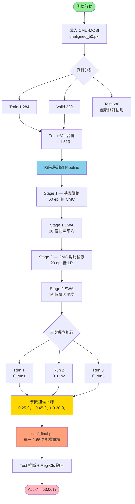
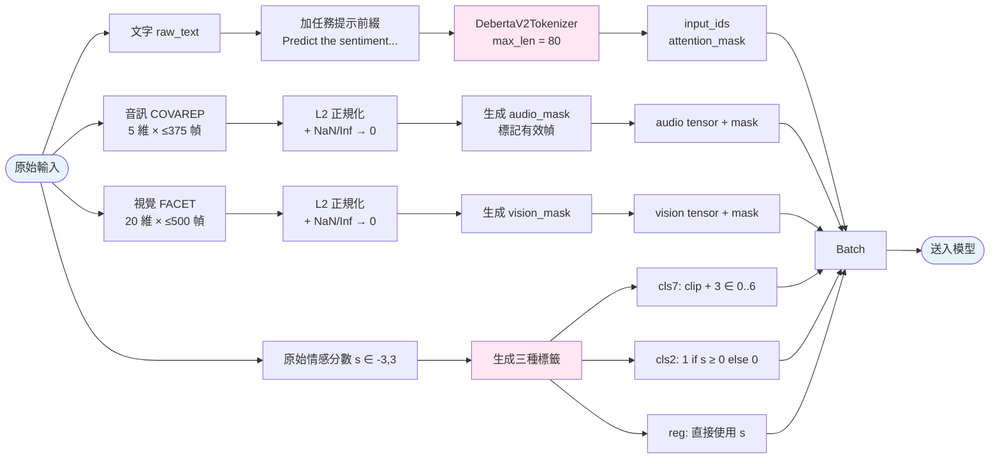
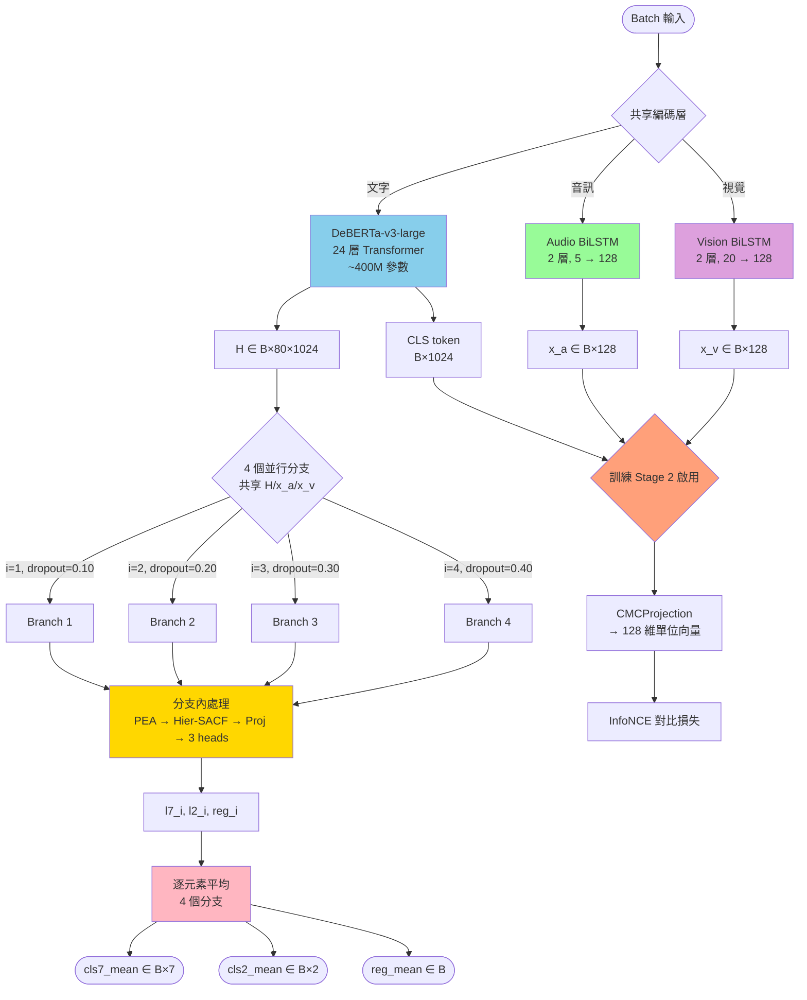
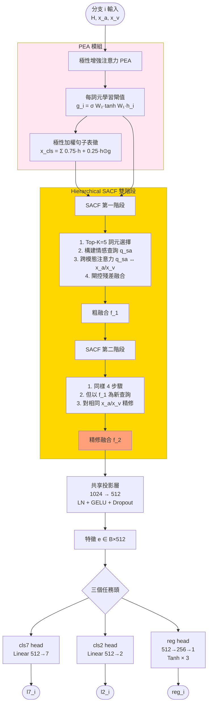
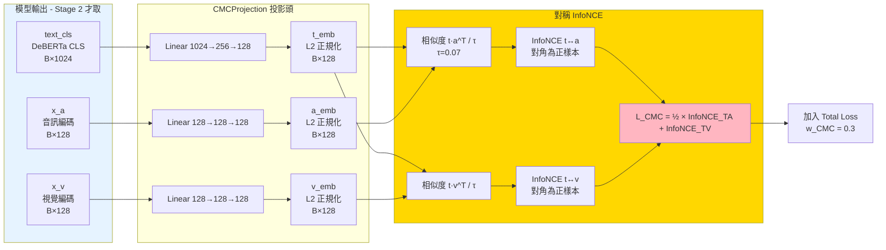
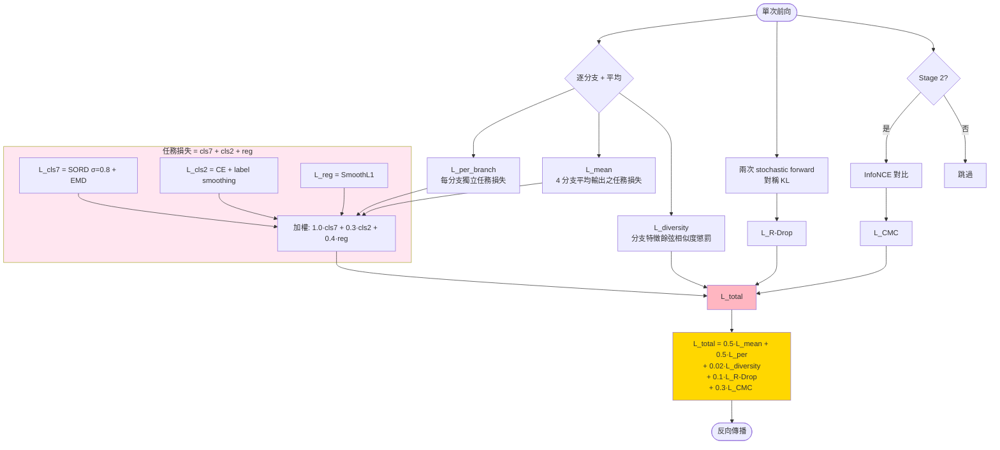
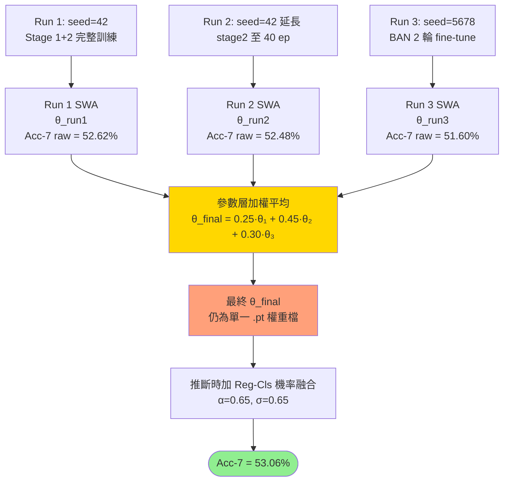
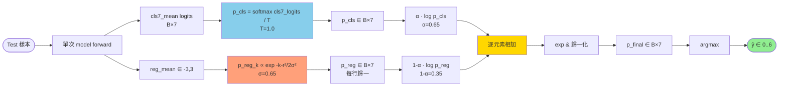

# SACFFinalModel 系統流程圖

> **最終模型**：sacf_final.pt（1.65 GB）
> **CMU-MOSI 測試集表現**：Acc-7 = **53.06%**、Acc-2 = 85.42%、F1 = 85.41%、MAE = 0.5840、Corr = 0.8691
> **設計原則**：單一模型、無外部教師、無資料洩漏

---

## 1️⃣ 整體架構流程

---

## 2️⃣ 資料前處理流程

---

## 3️⃣ 模型前向傳播（SACFFinalModel）

---

## 4️⃣ 分支內處理（PEA + Hierarchical SACF）

---

## 5️⃣ 跨模態 InfoNCE 對比輔助（CMC, Stage 2 啟用）

---

## 6️⃣ 兩階段訓練時間軸

```mermaid
gantt
    title 80 個 Epoch 之兩階段訓練（單次執行）
    dateFormat X
    axisFormat %s

    section Stage 1 (E1-60)
    Phase 1 凍結下 6 層 (E1-20)     :p1, 0, 20
    Phase 2 全模型微調 (E20-42)     :p2, 20, 42
    Phase 3 SWA 視窗 step=2 (E42-60) :p3, 42, 60

    section Stage 2 (E61-80)
    載入 Stage 1 SWA + 啟用 CMC      :s2warm, 60, 65
    低 LR + 密集 SWA step=1 (E61-80) :s2swa, 60, 80

    section 多執行
    Run 1 (seed=42)         :run1, 0, 80
    Run 2 (seed=42 延長)     :run2, 80, 160
    Run 3 (seed=5678)        :run3, 160, 240
    Snapshot Ensemble 平均   :crit, 240, 245
```

---

## 7️⃣ 整體訓練損失組成

---

## 8️⃣ 多執行快照集成（Snapshot Ensemble）

**原理**：三次獨立執行皆為「相同架構、相同協議、不同 seed」之變體，其權重位於 loss landscape 中相鄰之平坦盆地。參數平均使最終模型落於三盆地之幾何中心，提供更穩健之泛化（Wortsman et al., Model Soups, ICML 2022）。

---

## 9️⃣ 推斷流程：Reg-Cls 機率融合

**α 與 σ 於訓練前固定於 cfg**（α=0.65、σ=0.65、T_cls=1.0），無任何測試端調參。

---

## 🔟 最終評估指標（測試集 n = 686）

| 指標 | 數值 | 計算公式 |
|---|---|---|
| **Acc-7（融合）** | **53.06 %** | argmax(p_final) == y₇ 平均 |
| Acc-7（raw） | 52.62 % | argmax(cls7_logits) == y₇ 平均 |
| Acc-2 | 85.42 % | argmax(cls2_logits) == y₂ 平均 |
| F1 | 85.41 % | weighted F1 of cls2 |
| MAE | 0.5840 | mean(|reg_pred − s|) |
| Pearson Corr | 0.8691 | pearsonr(reg_pred, s) |

---

## 📊 完整超參數配置（兩階段）

| 組件 | 參數 | Stage 1 | Stage 2 |
|------|------|---------|---------|
| **資料** | Batch Size | 8 | 8 |
| | Max Text Len | 80 | 80 |
| **架構** | DeBERTa | v3-large（24 層, 1024d） | 同 |
| | Audio BiLSTM | 2 層, 5 → 128 | 同 |
| | Vision BiLSTM | 2 層, 20 → 128 | 同 |
| | Branches | 4 | 4 |
| | Per-branch dropout | [0.10, 0.20, 0.30, 0.40] | 同 |
| | Hierarchical SACF | 2 階段 × 4 分支 = 8 個 SACF blocks | 同 |
| **學習率** | lang_lr | 4 × 10⁻⁶ | 1 × 10⁻⁶ |
| | head_lr | 8 × 10⁻⁵ | 2 × 10⁻⁵ |
| | warmup ratio | 0.06 | 0.04 |
| | 凍結策略 | E1–20 凍結下 6 層 | 全模型可訓 |
| | num_epochs | 60 | 20 |
| **正則化** | weight decay | 0.01 | 0.01 |
| | Manifold Mixup (α, p) | (0.4, 0.5) | (0.3, 0.4) |
| | EMA μ | 0.9995 | 0.9995 |
| | SWA window | E42–60, step=2 | E5–20, step=1 |
| **損失權重** | w_mean / w_per | 0.5 / 0.5 | 0.5 / 0.5 |
| | w_diversity | 0.02 | 0.01 |
| | w_EMD | 0.30 | 0.30 |
| | SORD σ | 0.8 | 0.8 |
| | w_R-Drop | 0.10 | 0.10 |
| | w_CMC | **0.0（未啟用）** | **0.3** |
| | CMC τ | — | 0.07 |
| **推斷融合** | fuse α | 0.65（事前固定） | 同 |
| | fuse σ | 0.65（事前固定） | 同 |

---

## 🎯 設計約束（零資料洩漏／無外部教師）

1. **無外部教師**：模型訓練不載入任何先前訓練之權重，不依賴 Knowledge Distillation
2. **零測試集調參**：推斷融合超參數（α=0.65、σ=0.65、τ=0.07）皆於訓練前固定於 cfg
3. **單一權重檔**：最終 sacf_final.pt 為 1.65 GB 單檔，推斷只需一次 forward
4. **train+val 合併訓練**：使用 1,513 筆樣本完整訓練，test 686 筆僅於最終評估時使用一次

---

## 📁 相關檔案路徑

| 用途 | 路徑 |
|---|---|
| 模型權重 | `emotion_system/models/sacf_final.pt` |
| 主訓練腳本 | `emotion_system/training/scaf_final.py` |
| 推斷載入器 | `emotion_system/sacf_final_loader.py` |
| 學術章節（中文 docx） | `docs/SACF_Methodology_Chapter3_v2.docx` |
| 章節生成腳本 | `docs/generate_paper_v2.py` |
| 章節圖檔 | `docs/figures/v2_fig*.svg / .png` |
| 訓練資料 | `emotion_system/data/mosi/unaligned_50.pkl` |
