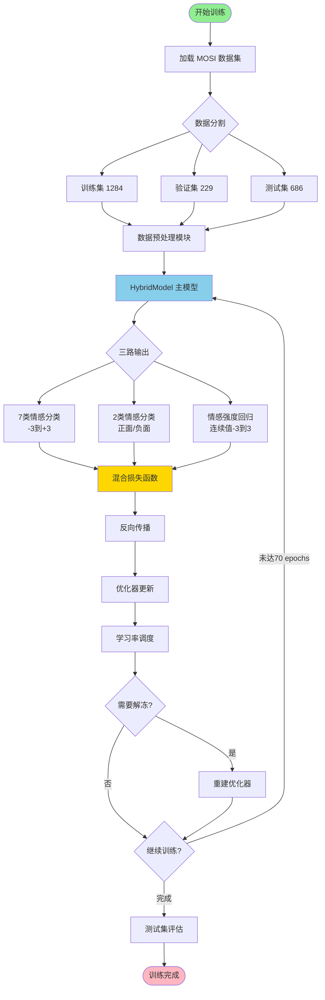
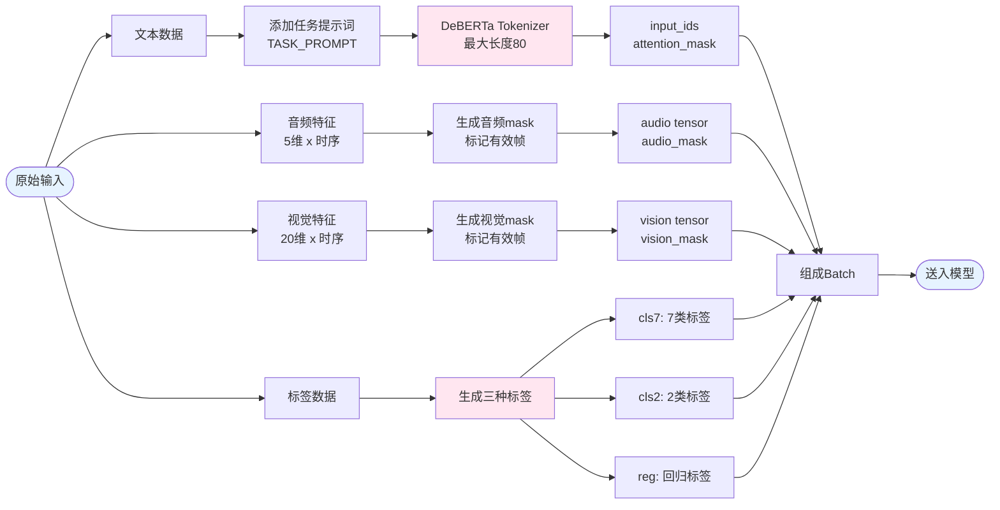
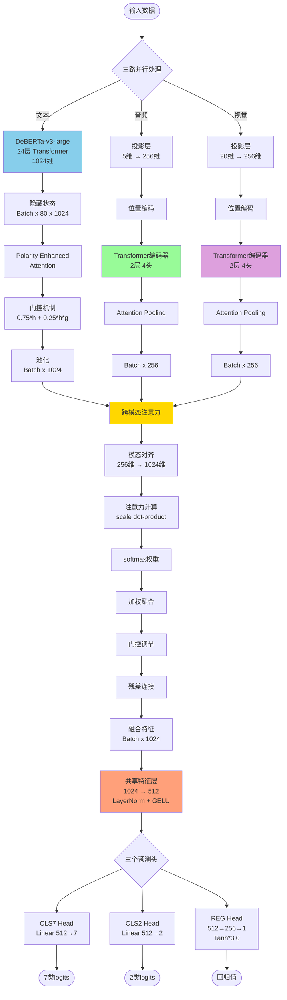
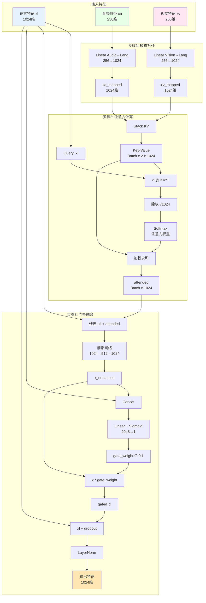
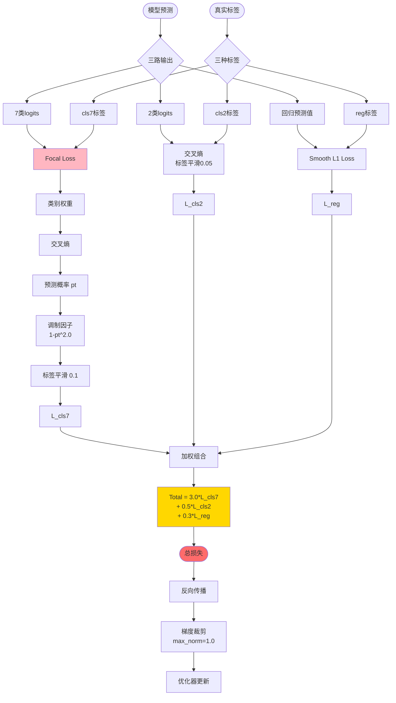
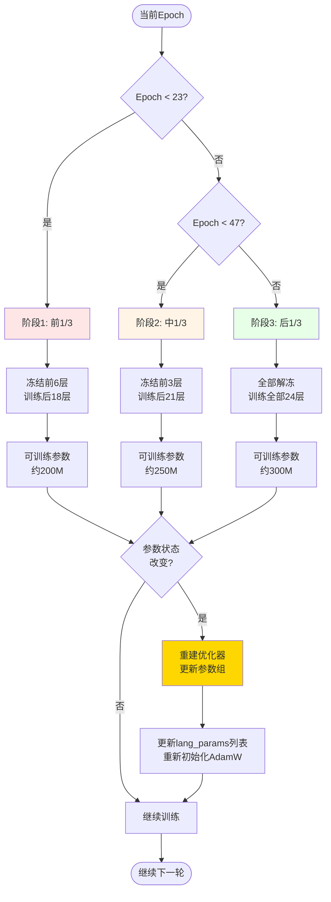
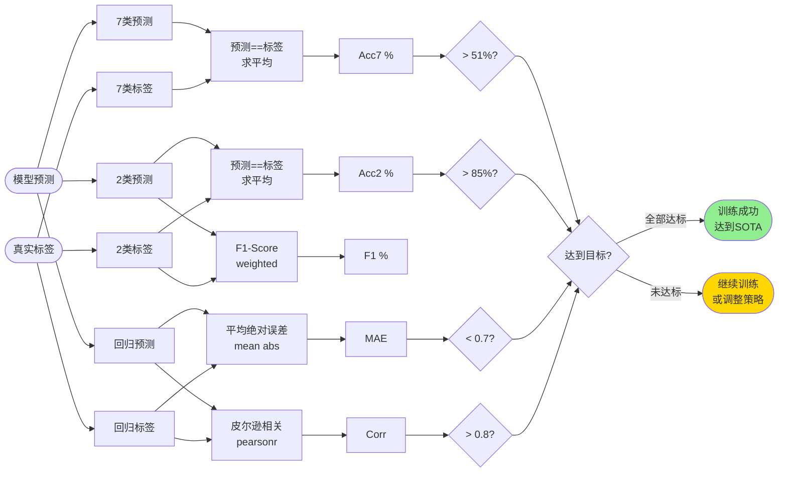

# SCAF v15 系统流程图

## 1️⃣ 整体架构流程



## 2️⃣ 数据预处理详细流程



## 3️⃣ 模型前向传播核心流程



## 4️⃣ 跨模态注意力机制详解



## 5️⃣ 训练策略时间线

```mermaid
gantt
    title SCAF v15 训练70个Epochs的策略
    dateFormat X
    axisFormat %s

    section 语言模型解冻
    冻结前6层 (训练18层)    :freeze6, 0, 23
    冻结前3层 (训练21层)    :freeze3, 23, 47
    全部解冻 (训练24层)     :freeze0, 47, 70

    section 学习率调度
    Warmup (线性增长)       :warm, 0, 7
    Cosine衰减              :cosine, 7, 70

    section 训练阶段
    初期快速学习            :crit, 0, 15
    中期稳定优化            :active, 15, 50
    后期精细调优            :50, 70
```



## 6️⃣ 损失函数计算流程



## 7️⃣ 渐进式解冻决策树



## 8️⃣ 评估指标计算流程



## 📊 关键超参数配置表

| 组件 | 参数 | v15值 | 说明 |
|------|------|-------|------|
| **数据** | Batch Size | 8 | 小batch更稳定 |
| | Max Text Len | 80 | DeBERTa输入长度 |
| **模型** | Audio Dim | 5 | COVAREP特征 |
| | Vision Dim | 20 | Facet特征 |
| | Modal Hidden | 256 | 非语言编码维度 |
| | Fusion Dim | 512 | 融合层维度 |
| | Dropout | 0.2 | 正则化 |
| **优化** | Lang LR | 5e-6 | 语言模型学习率 |
| | Other LR | 1e-4 | 其他模块学习率 |
| | Weight Decay | 1e-2 | L2正则 |
| | Warmup Ratio | 0.1 | 10%步数预热 |
| | Epochs | 70 | 训练轮数 |
| **损失** | Alpha (cls7) | 3.0 | 7类权重 |
| | Beta (cls2) | 0.5 | 2类权重 |
| | Gamma (reg) | 0.3 | 回归权重 |
| | Focal Gamma | 2.0 | Focal Loss参数 |

## 🎯 训练目标对比

```
Epoch 1  预期: >= 20%   (v10仅4.37%, old达15.72%)
Epoch 10 预期: >= 40%
Epoch 70 预期: >= 51%   (MGT SOTA: 55.6%)
```
